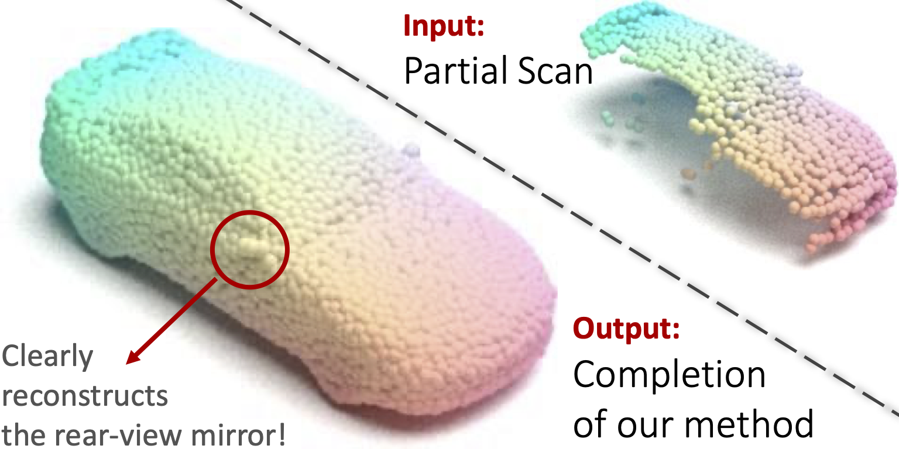
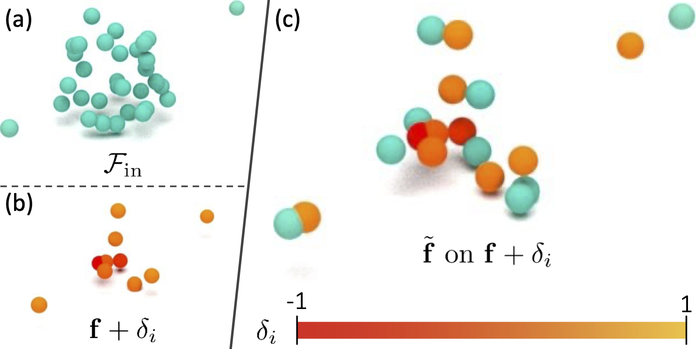
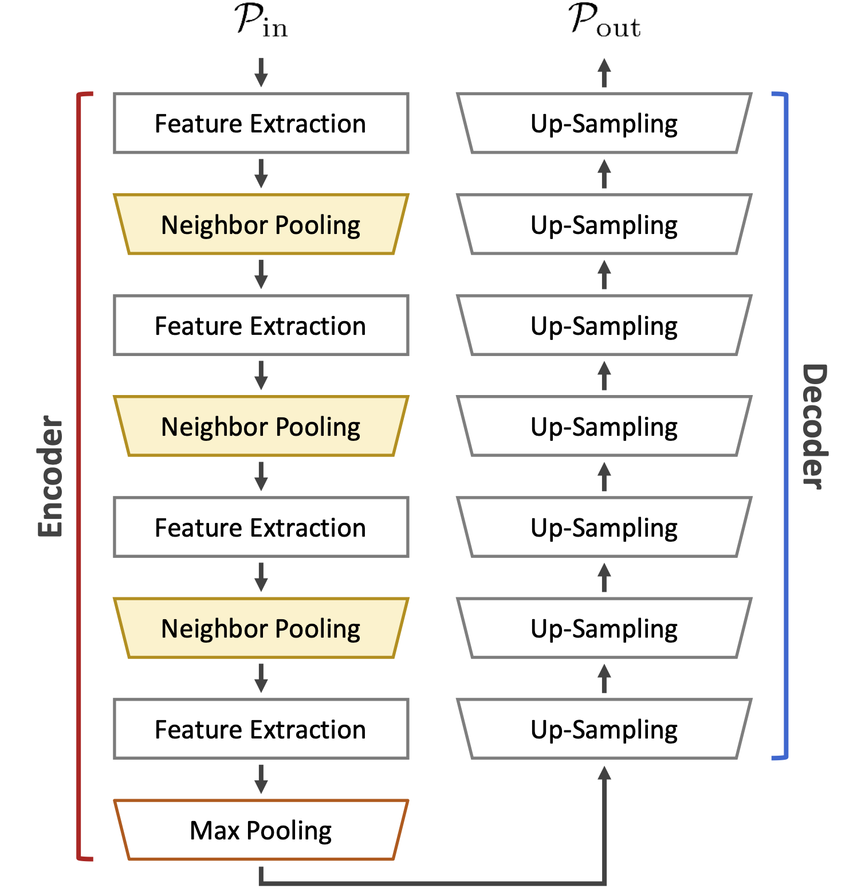
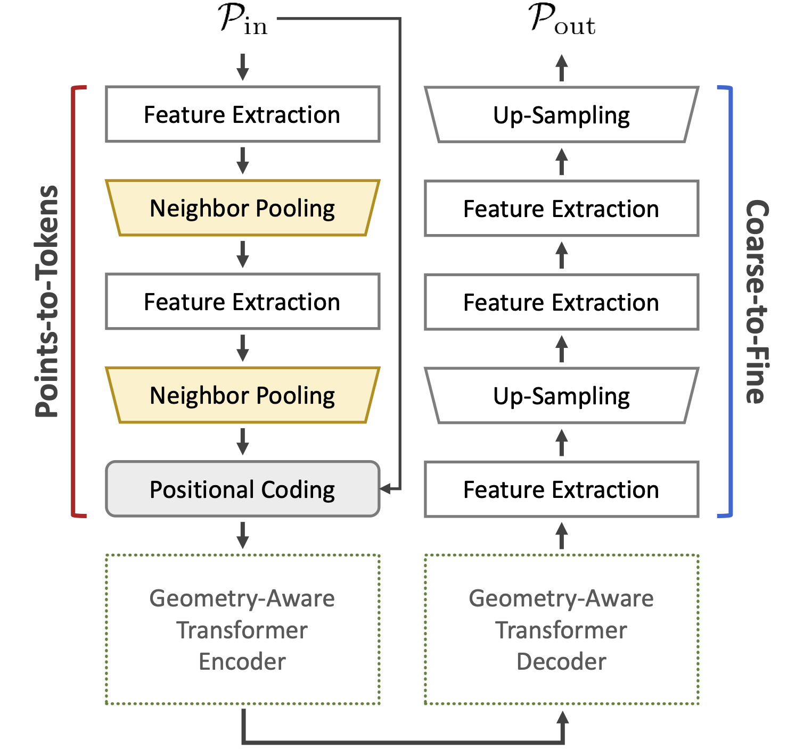

| [paper]() | [code]() |

# Abstrarct



We propose a novel approach aimed at object and semantic scene completion from a partial scan represented as a 3D point cloud.
Our architecture relies on three novel layers that are used successively within an encoder-decoder structure and specifically developed for the task at hand.
The first one carries out feature extraction by matching the point features to a set of pre-trained local descriptors.
Then, to avoid losing individual descriptors as part of standard operations such as max-pooling, we propose an alternative neighbor-pooling operation that relies on adopting the feature vectors with the highest activations. Finally, up-sampling in the decoder modifies our feature extraction in order to increase the output dimension.
While this model is already able to achieve competitive results with the state of the art, we further propose a way to increase the versatility of our approach to process point clouds. To this aim, we introduce a second model that assembles our layers within a transformer architecture.
We evaluate both architectures on object and indoor scene completion tasks, achieving state-of-the-art performance.

## Local displacement operator
 

## Optional architectures
| Direct | Transformer |
:-------------------------:|:-------------------------:
  | 


# Cite

If you find this work useful in your research, please cite:

```bash
```
